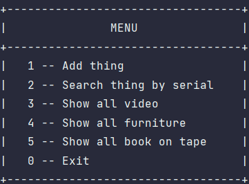
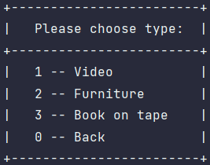
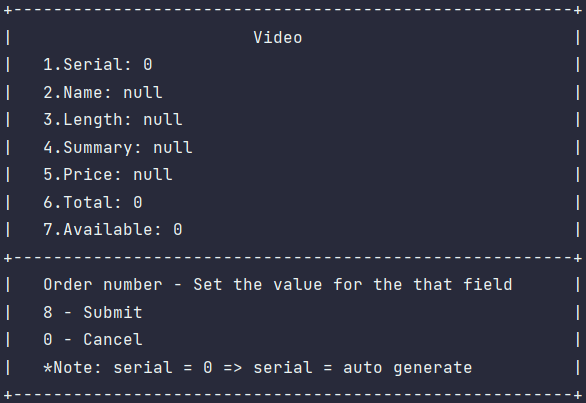
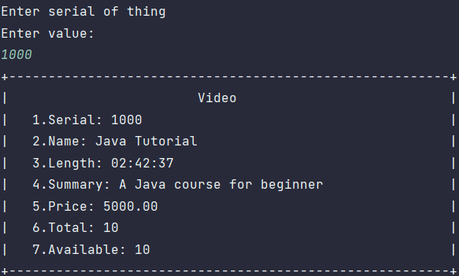
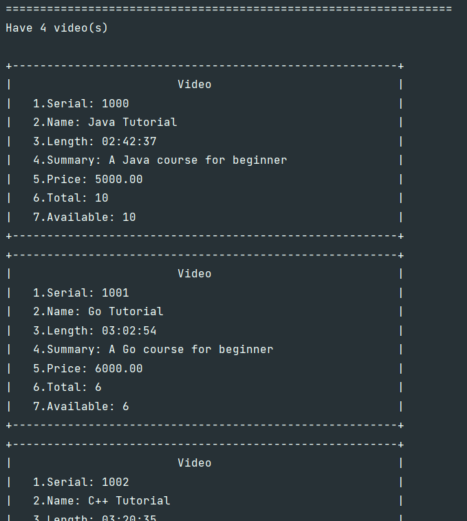

# THING MANAGEMENT CONSOLE APPLICATION

## Introduce
A console application manage things with h2 database 
 
This project is FPT Java Fresher Entry Test ([view more](./doc/FR.ET.Practice.02.pdf)) 
 
Functions: Handle exception and simple validate input 

## UML Diagram
#### Database

#### Class Diagram

## UI Capture
#### Main menu

#### Add thing

#### Form

#### Search by serial

#### Show all

